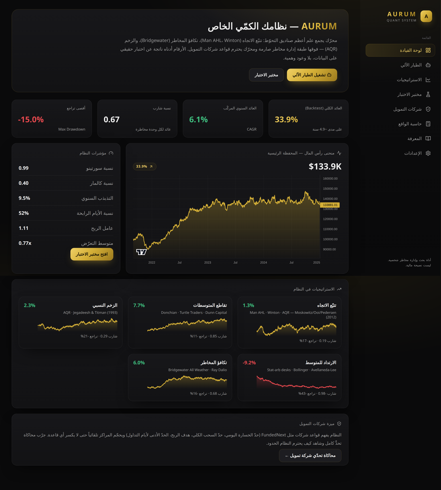
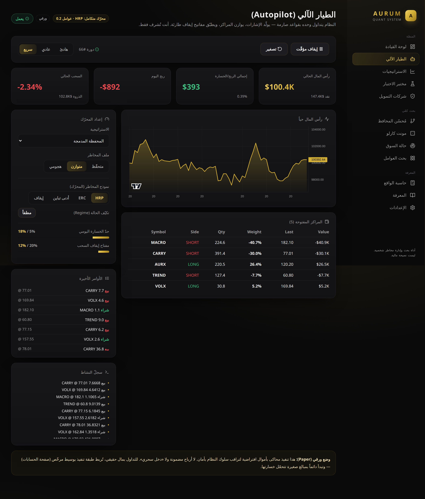
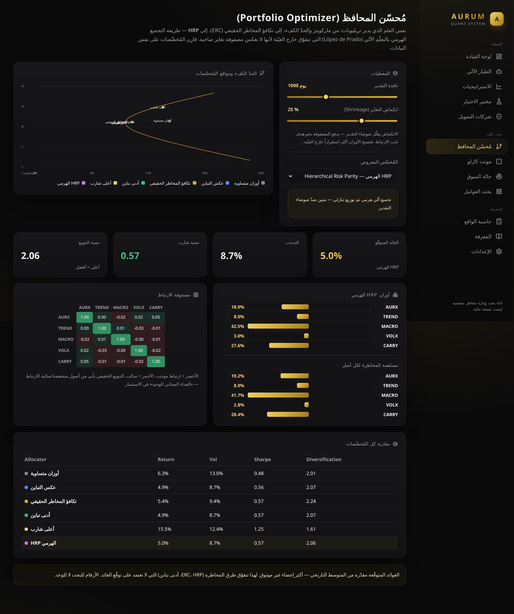
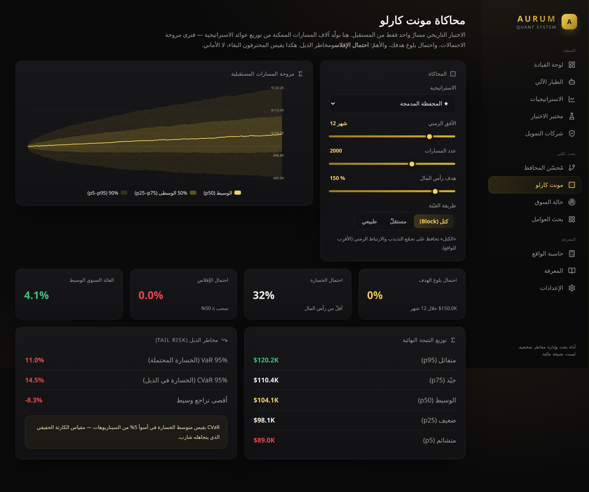
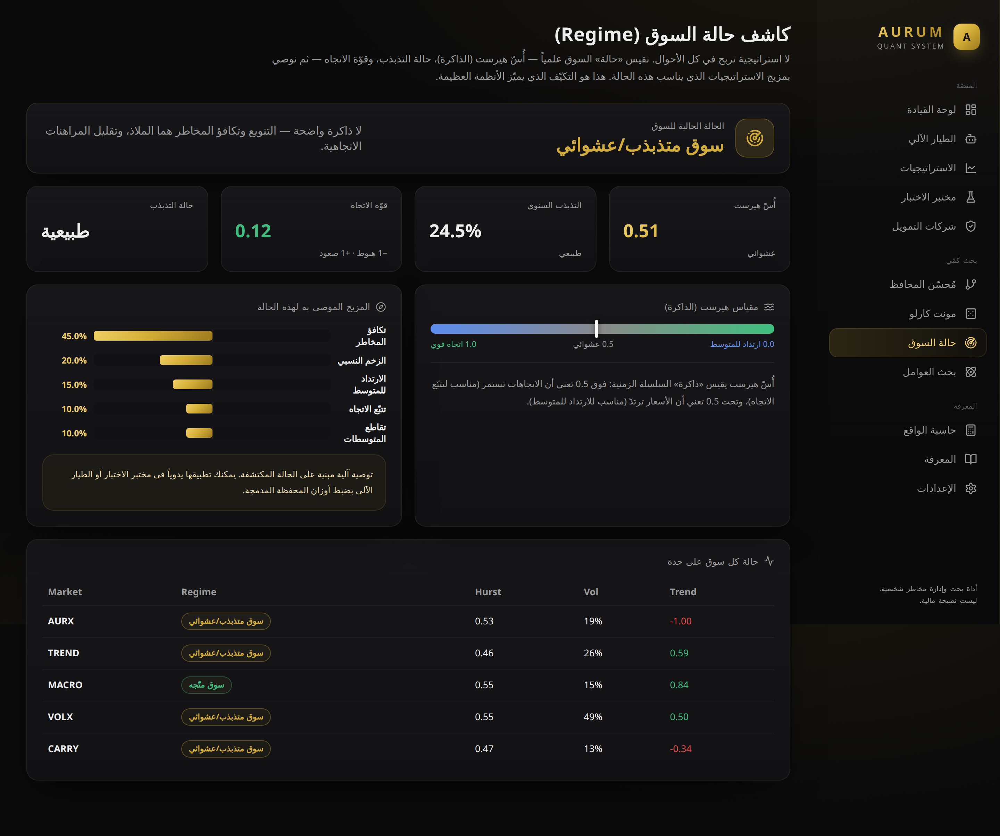
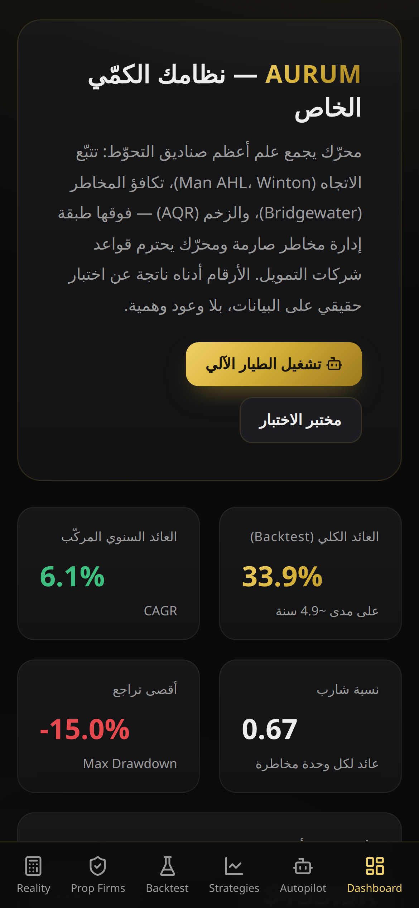
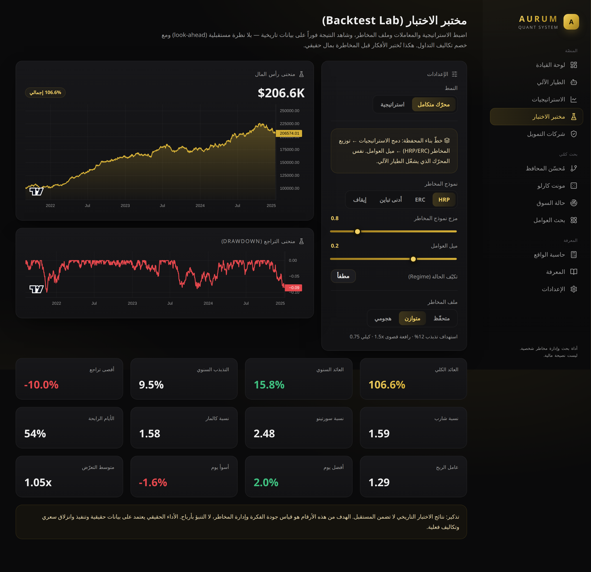
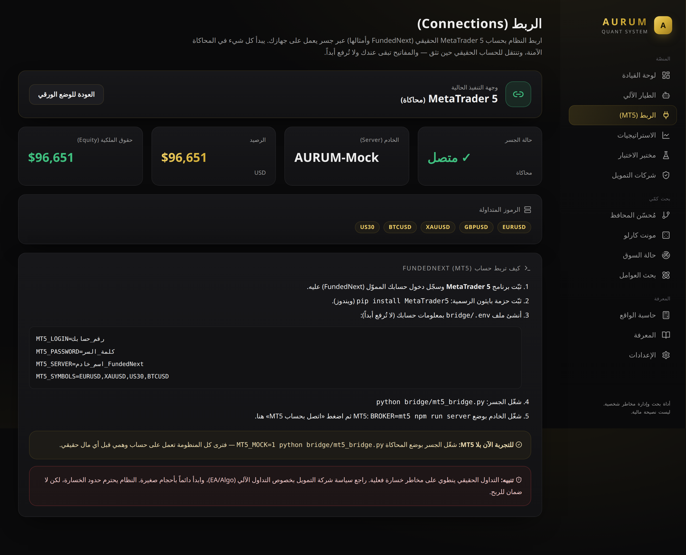

# AURUM — نظام تداول كمّي شخصي (Quant Trading System)

تطبيق ويب/هاتف (PWA) بتصميم أسود/ذهبي فاخر، يجمع **علم أعظم صناديق التحوّط** في محرّك واحد:
استراتيجيات مثبتة + إدارة مخاطر صارمة + محرّك يفهم قواعد شركات التمويل (FundedNext وأمثالها)
ويحترمها، مع مختبر اختبار تاريخي (Backtest) وحاسبة واقعية للتراكم.

> أداة **شخصية للبحث وإدارة المخاطر** — وليست نصيحة مالية ولا تَعِد بأرباح.

---

## 🖼️ معاينة

| لوحة القيادة | الطيار الآلي (حيّ) |
|:---:|:---:|
|  |  |
| **مُحسّن المحافظ + الحدّ الكفء** | **محاكاة مونت كارلو** |
|  |  |

<p align="center"></p>
<p align="center"></p>

> لإعادة توليد الصور: `npx puppeteer browsers install chrome` ثم `npm run preview:shots` (والتطبيق يعمل عبر `npm run dev:all`).

## ⚠️ الحقيقة أولاً (اقرأ هذا)

- **لا يوجد** «5$ → مليون في شهر»، ولا «مليار في سنة»، ولا «دخل سلبي مضمون». هذه أرقام مستحيلة
  رياضياً وعلامات احتيال. صفحة **«حاسبة الواقع»** داخل التطبيق تُثبت ذلك بالأرقام.
- أعلى عائد مستدام في تاريخ صناديق التحوّط هو **~39% صافي سنوياً** (صندوق Medallion). أيّ وعد
  بأكثر من ذلك بثبات = خداع.
- الطريق الحقيقي للثروة: **استراتيجية مثبتة + إدارة مخاطر تحفظ رأس المال + انضباط + وقت
  (التراكم)**. هذا ما يقدّمه هذا التطبيق.

---

## ✨ المزايا

| القسم | الوصف |
|------|-------|
| **لوحة القيادة** | منحنى رأس المال للمحفظة الرئيسية + أهمّ المؤشرات (CAGR، شارب، أقصى تراجع). |
| **الطيار الآلي** | محرّك تنفيذ ذاتي يعمل على خادم 24/7: يولّد الإشارات، يوازن المراكز، ويطبّق مفاتيح إيقاف طارئة — بلا تدخّل. يبدأ ورقياً (Paper). |
| **الربط (MT5)** | اربط حساب MetaTrader 5 حقيقي (FundedNext وأمثالها) عبر جسر Python؛ تداول رموزاً حقيقية بأحجام لوت صحيحة. وضع محاكاة للتجربة بلا مال. |
| **مُحسّن المحافظ** | الحدّ الكفء (ماركويتز)، أدنى تباين، أعلى شارب، تكافؤ مخاطر حقيقي (ERC)، و**HRP** الهرمي + خريطة ارتباط وانكماش تغاير. |
| **مونت كارلو** | آلاف المسارات المستقبلية: مروحة الاحتمالات، احتمال الهدف/الخسارة/الإفلاس، و VaR/CVaR لمخاطر الذيل. |
| **حالة السوق** | كشف الحالة عبر أُسّ هيرست والتذبذب وقوّة الاتجاه، مع توصية تكيّفية بمزيج الاستراتيجيات. |
| **بحث العوامل** | تسجيل الأصول على عوامل (زخم/اتجاه/تذبذب منخفض/ارتداد/جودة) + محفظة طويل/قصير. |
| **الاستراتيجيات** | 5 استراتيجيات حقيقية: تتبّع الاتجاه، تقاطع المتوسطات، الزخم النسبي، الارتداد للمتوسط، تكافؤ المخاطر. |
| **مختبر الاختبار** | اضبط المعاملات وملف المخاطر، وشاهد النتيجة فوراً بلا نظرة مستقبلية ومع خصم التكاليف. |
| **شركات التمويل** | محرّك يفهم قواعد التحدّي ويُحجّم المراكز تلقائياً حتى لا يكسر أيّ حدّ. |
| **حاسبة الواقع** | رياضيات التراكم + لماذا الأرقام «الخيالية» مستحيلة. |
| **المعرفة** | خلاصة علوم أعظم الكتب والصناديق وقوانين المخاطر الحديدية. |

## ⚙️ المحرّك المتكامل (Portfolio Construction)

العلوم **مدمجة فعلياً في محرّك القرار** (`src/engine/portfolio.ts`) الذي يشغّل **الطيار الآلي
والـ backtest معاً** — وليست مجرّد صفحات عرض. البنية هي بنية أعظم الصناديق الكمّية:

```
توليد الإشارة → التكيّف مع الحالة → توزيع المخاطر → ميل العوامل → ضبط المخاطر والتنفيذ
(الاستراتيجيات)     (Regime)        (HRP/ERC)        (AQR)          (vol target + prop)
```

**الإعدادات الافتراضية اختيرت بالأرقام لا بالذوق** (`npm run engine`):

| الإعداد | عائد سنوي | شارب | أقصى سحب | كالمار |
|---|---|---|---|---|
| الأساس (دمج متساوٍ) | 4.3% | 0.49 | −13.5% | 0.32 |
| **المحرّك المتكامل (HRP + عوامل)** | **15.8%** | **1.59** | **−10.0%** | **1.58** |

تحسّن في **كل المقاييس دفعةً واحدة**: عائد أعلى ومخاطرة أقل. تكيّف الحالة (Regime) متاح لكنه مطفأ
افتراضياً لأنه أضرّ بالأداء على بيانات العرض — **الصدق فوق الادعاء**.



## 🧠 العلم خلف الاستراتيجيات

- **تتبّع الاتجاه (Time-Series Momentum):** Moskowitz, Ooi & Pedersen (2012) — محرّك Man AHL / Winton / AQR.
- **الزخم النسبي (Cross-Sectional Momentum):** Jegadeesh & Titman (1993) — نهج AQR.
- **تكافؤ المخاطر (All-Weather):** Ray Dalio / Bridgewater.
- **الارتداد للمتوسط (Stat-Arb):** Avellaneda–Lee، Bollinger.
- **إدارة المخاطر:** استهداف التذبذب، معيار كيلي الجزئي، حدّ الرافعة، التحكّم في السحب.

## 🏗️ المعمارية

```
src/
├─ engine/            # محرّك كمّي نقي (بلا UI) — يشغّل الأبحاث والتنفيذ الحيّ معاً
│  ├─ types.ts        # الأنواع الأساسية
│  ├─ indicators.ts   # مؤشرات فنية (SMA, EMA, RSI, ATR, z-score, vol...)
│  ├─ metrics.ts      # شارب، سورتينو، كالمار، أقصى تراجع، CAGR...
│  ├─ data.ts         # مولّد بيانات تركيبية + قارئ CSV حقيقي
│  ├─ strategies.ts   # الاستراتيجيات + الدمج (Ensemble)
│  ├─ risk.ts         # طبقة إدارة المخاطر (vol targeting, Kelly, gross cap)
│  ├─ propFirm.ts     # محرّك قواعد شركات التمويل + الحارس + التقييم
│  ├─ backtest.ts     # محرّك الاختبار التاريخي (بلا look-ahead)
│  ├─ portfolio.ts    # خطّ بناء المحفظة: regime → نموذج مخاطر (HRP/ERC) → ميل عوامل
│  ├─ linalg.ts       # جبر خطي: تغاير، ارتباط، انكماش Ledoit-Wolf، عكس المصفوفات
│  ├─ optimize.ts     # ماركويتز، الحدّ الكفء، ERC، HRP، أدنى تباين، أعلى شارب
│  ├─ montecarlo.ts   # محاكاة المسارات + احتمالات + VaR/CVaR
│  ├─ regime.ts       # أُسّ هيرست + كشف الحالة + توصية تكيّفية
│  ├─ factors.ts      # نموذج العوامل (z-scores) + محفظة طويل/قصير
│  └─ riskmetrics.ts  # VaR/CVaR، الالتواء، التفرطح، مؤشر القرحة
├─ components/        # رسوم بيانية ومكوّنات واجهة
├─ pages/             # صفحات التطبيق (منها Autopilot و Connect الحيّتان)
├─ lib/               # عميل الـ API + أدوات التنسيق
└─ state/             # الحالة العامة

server/               # خادم الطيار الآلي (Node + Express) — يعمل 24/7 مستقلاً عن المتصفّح
├─ index.ts           # واجهة REST للتحكّم والبثّ الحيّ والربط
├─ autopilot.ts       # حلقة التداول الذاتي (async) + مفاتيح الإيقاف + حفظ الحالة
├─ adapters.ts        # واجهات Source/Broker + محوّلات Paper و MT5
├─ broker.ts          # Paper Broker (محاكاة داخلية)
├─ marketData.ts      # مزوّد بيانات تركيبي حيّ
└─ types.ts           # أنواع الخادم

bridge/               # جسر MetaTrader 5 (Python) — يعمل على جهازك بجانب MT5
├─ mt5_bridge.py      # HTTP محلي: حساب/مراكز/أسعار/أوامر (وضعا live و mock)
├─ requirements.txt   # MetaTrader5 (للوضع الحقيقي فقط)
└─ README.md          # خطوات ربط FundedNext
```

## 🚀 التشغيل

```bash
npm install

# الويب + محرّك الطيار الآلي معاً (الأسهل):
npm run dev:all      # الواجهة http://localhost:5173 · المحرّك http://localhost:8787

# أو منفصلَين:
npm run dev          # الواجهة فقط
npm run server       # محرّك الطيار الآلي فقط (Node)

npm run build        # بناء للإنتاج (dist/)
npm run smoke        # اختبار دخان للمحرّك الكمّي
```

يعمل على الهاتف عبر المتصفّح (تصميم متجاوب) ويمكن **تثبيته كتطبيق (PWA)** من قائمة المتصفّح.
افتح صفحة **«الطيار الآلي»** ثم اضغط «تشغيل» لتشاهد النظام يتداول وحده (ورقياً).

## 🔗 الربط بحساب حقيقي (MetaTrader 5 / FundedNext)

النظام يتداول حساب **MetaTrader 5** حقيقياً عبر جسر Python خفيف يعمل على جهازك بجانب MT5 — بنفس
محرّك الأبحاث. ابدأ بالمحاكاة، ثم بمفاتيح حسابك المموّل.



**جرّب الآن بلا MT5 (محاكاة كاملة end-to-end):**

```bash
MT5_MOCK=1 npm run bridge     # الجسر بوضع المحاكاة (يعمل تلقائياً كمحاكاة إن لم تُثبّت MetaTrader5)
BROKER=mt5 npm run server     # الخادم بوضع MT5
npm run dev                   # الويب — ثم صفحة «الربط» → «اتصل بحساب MT5»
```

**للحساب الحقيقي (FundedNext):** ثبّت MetaTrader 5 + `pip install -r bridge/requirements.txt`،
عبّئ `bridge/.env` ببيانات حسابك، ثم `npm run bridge`. التفاصيل في
[`bridge/README.md`](bridge/README.md).

> 🪟 **مستخدم Windows مبتدئ؟** اتبع الدليل العربي خطوة بخطوة [`دليل-ويندوز.md`](دليل-ويندوز.md)
> مع ملفات تشغيل بنقرة واحدة في مجلد [`windows/`](windows/).

> ⚠️ لا «دخل مضمون». التداول الحقيقي مخاطرة فعلية. النظام يحترم حدود الخسارة (يومي/كلي) ومفاتيح
> الإيقاف، لكنه لا يُلغي مخاطر السوق. راجع سياسة شركة التمويل بخصوص التداول الآلي، وابدأ بأحجام صغيرة.

## 📜 إخلاء مسؤولية

التداول ينطوي على مخاطر خسارة حقيقية. لا توجد عوائد مضمونة. هذا التطبيق أداة تعليمية/بحثية
لإدارة المخاطر، وليس نصيحة مالية. اختبر دائماً، خاطر بما تتحمّل خسارته، والتزم قوانين وضرائب بلدك.
